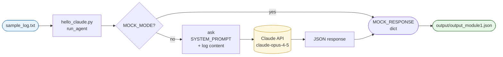
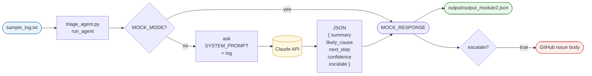
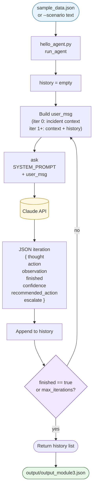
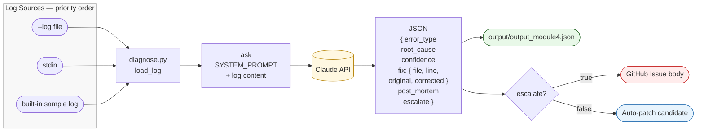
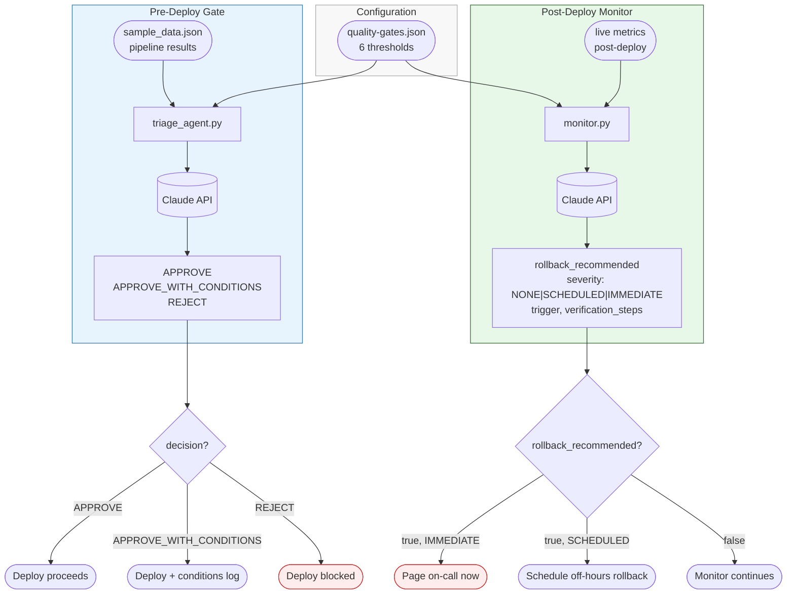
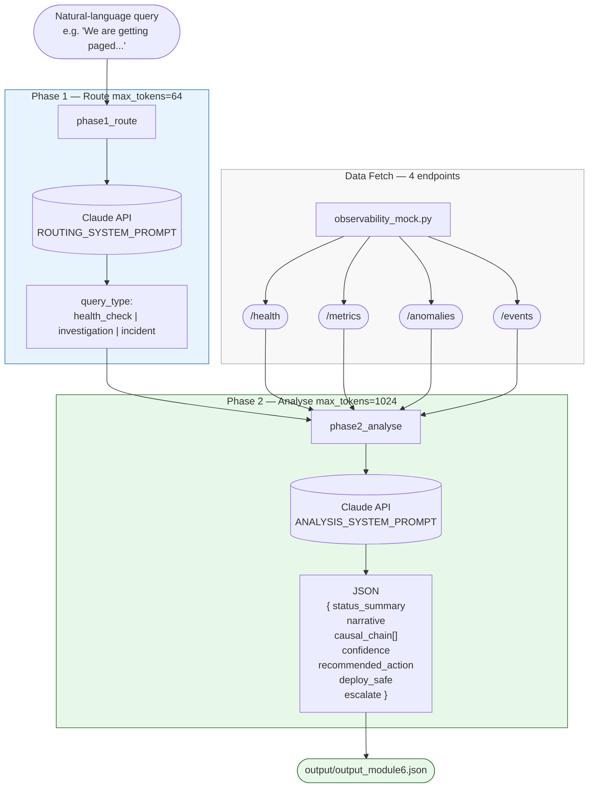
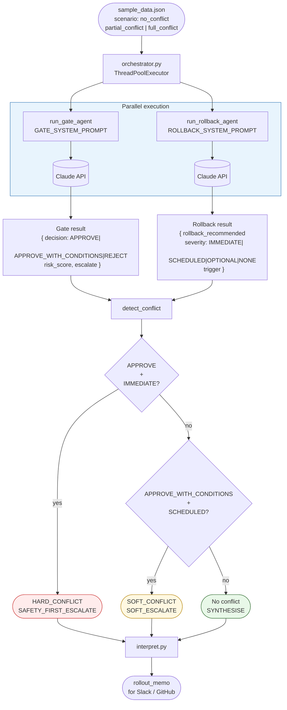
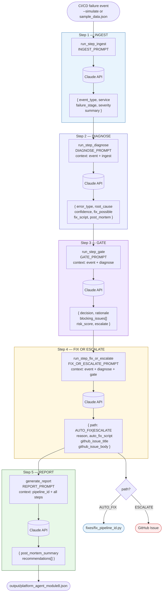

# Agent Architecture Diagrams

One diagram per module. Renders in VS Code's built-in Markdown preview (`Cmd+Shift+V`) and natively on GitHub.

---

## Module 1 — Hello Claude (Single-Shot Agent)

---

## Module 2 — Structured JSON Agent

---

## Module 3 — ReAct Loop Agent

---

## Module 4 — CI/CD Diagnostic Agent

---

## Module 5 — Quality Gate + Post-Deploy Monitor

---

## Module 6 — Two-Phase Conversational Observability Agent

---

## Module 7 — Parallel Multi-Agent Orchestrator

---

## Module 8 — Capstone 5-Step Platform Agent Pipeline

